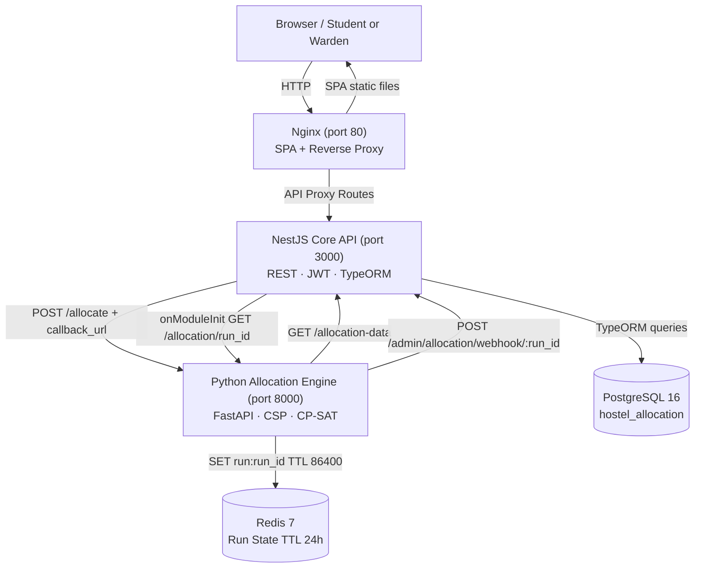
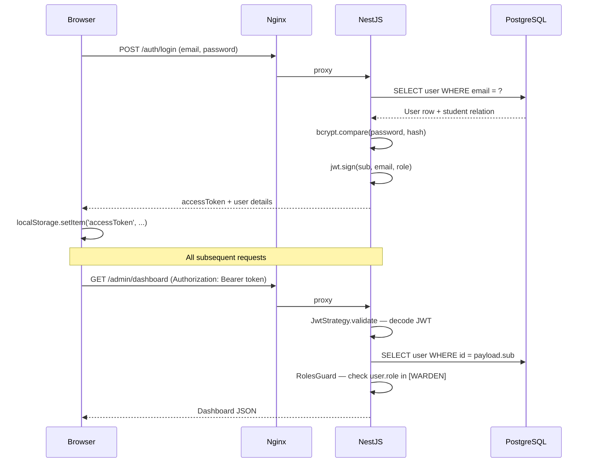
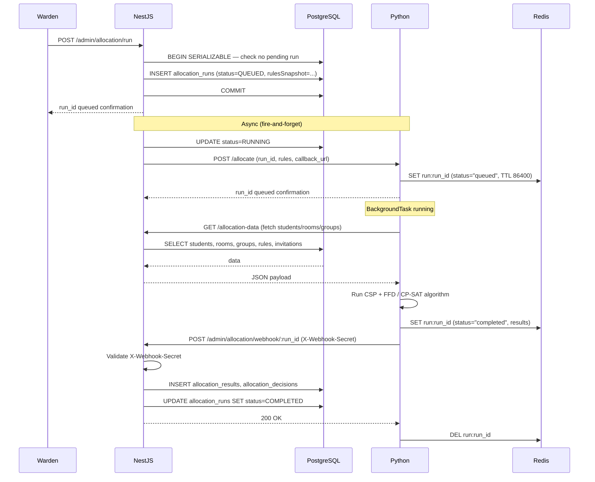
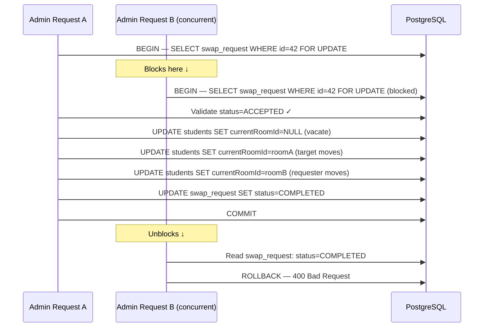
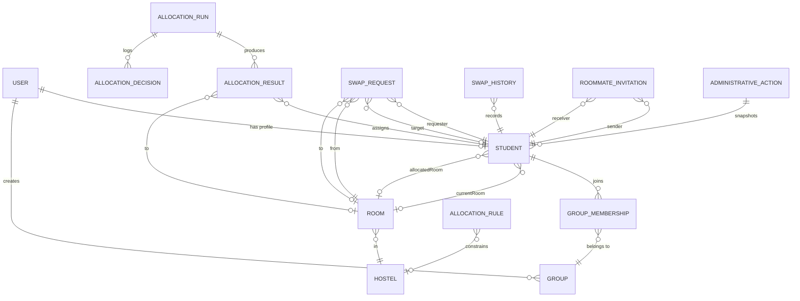

# Hostel Allocation System

**A full-stack constraint-solving hostel room allocation platform — not a spreadsheet replacement, but a verifiable, transactional system that encodes institutional policy as executable rules and coordinates a distributed allocation workflow across three services.**

Universities typically handle hostel allocation through spreadsheets, email chains, and manual assignment by wardens. This process does not scale, fails to encode institutional eligibility rules reliably, ignores student group preferences, and has no audit trail. This project replaces that workflow with a complete software system: students apply and form groups, administrators configure policy rules, a Python constraint-solving engine runs the allocation asynchronously, and wardens commit or roll back results — all with referential integrity and database-enforced invariants protecting every state transition.

The intended users are two distinct roles: **students** (who apply for hostels, form roommate groups, submit preferences, view their allocation, and request room swaps) and **wardens/administrators** (who manage hostel infrastructure, configure allocation rules, trigger and review allocation runs, manually override results, execute swaps, and roll back allocations). These roles are enforced through a JWT + RBAC authorization model at the API level.

The core engineering challenge is that a hostel allocation is not a simple assignment problem — it requires atomic roommate placement, priority-ordered rule satisfaction, multi-student swap concurrency with TOCTOU safety, and a durable audit log that supports rollback. A naive CRUD approach would allow race conditions, silent constraint violations, and irreversible administrative mistakes.

---

## At a Glance

| Area | Details |
| --- | --- |
| **Architecture** | Distributed multi-service: React SPA + NestJS REST API + Python FastAPI allocation engine |
| **Frontend** | React 19 + React Router v7 (SPA mode), Tailwind CSS v4, Zustand, Axios, `@dnd-kit` |
| **Backend (Core API)** | NestJS 11, TypeORM 0.3, PostgreSQL 16, PassportJS + `passport-jwt` |
| **Allocation Engine** | Python 3, FastAPI, `python-constraint` (CSP), Google OR-Tools CP-SAT, FFD bin-packing |
| **Primary Database** | PostgreSQL 16 with TypeORM migrations, JSONB columns, `BEFORE UPDATE` trigger, partial unique indexes |
| **Ephemeral State Store** | Redis 7 (allocation run lifecycle state; 24-hour TTL; no disk persistence) |
| **Authentication** | JWT Bearer tokens, bcrypt password hashing, role-based access control (`STUDENT` / `WARDEN`) |
| **API Documentation** | Swagger / OpenAPI (served at `/api/docs`) |
| **Service Communication** | REST + webhook push (Python → NestJS); internal Nginx reverse proxy (browser → NestJS) |
| **Deployment** | Docker Compose with 5 services (`postgres`, `redis`, `allocation-engine`, `core-services`, `frontend`) |
| **Testing** | Jest E2E integration suite bootstrapping a live `AppModule` against real PostgreSQL |
| **Observability** | NestJS `Logger` with structured log lines per allocation run lifecycle event |

---

## Why I Built This

Hostel allocation at scale involves competing constraints: gender-segregated buildings, year-seniority rules, wing capacity limits, mandatory roommate atomicity, and first-come-first-serve fairness. When these constraints are encoded in spreadsheets, they are neither machine-verifiable nor composable. A warden modifying a spreadsheet can produce an over-capacity room, split a confirmed roommate pair, or assign a female student to a male hostel — and none of these errors surface until check-in.

The technically interesting problem is not the UI or the CRUD layer. It is the combination of:

1. **How do you represent allocation policy as composable, priority-ordered rules** that an algorithm can evaluate deterministically?
2. **How do you guarantee room capacity is never exceeded** even under concurrent writes from multiple administrators?
3. **How do you safely swap two students' rooms** when a database trigger enforces capacity at the row level, and the naive update order deadlocks?
4. **How do you run a potentially long CPU-bound allocation computation** without blocking the API, and recover gracefully if the worker process restarts mid-run?
5. **How do you enable rollback** of a bulk room-assignment operation that already wrote to hundreds of student rows?

Each of these questions has a concrete, verifiable answer in this codebase.

---

## Core Capabilities

### Student Application Workflow

Students register, submit a hostel application (with an ordered preference list of hostels), and optionally form a group or send a roommate invitation to a specific peer. The application window is administrator-controlled via a system setting (`applications_enabled`). Once closed, no new applications are accepted. The `applicationTimestamp` is recorded at submission time and is used by the FCFS allocation mode for deterministic ordering.

A student's eligibility for specific hostels and wings is derived at query time from the `allocation_rules` table — the `/students/me/eligibility` endpoint runs the same rule-evaluation logic used by the Python engine, showing students only the hostels and wings they qualify for before they submit.

### Group Formation

Students can create a group and invite peers by roll number. Group membership is a join table (`group_memberships`) with `pending` / `accepted` / `declined` states. The allocation engine treats accepted group members as a unit, finding a wing with sufficient contiguous capacity to place the entire group together before falling back to proximity-aware splitting.

Separately, students can send a **roommate invitation** to a specific peer, which is tracked in `roommate_invitations`. An accepted roommate pair is treated as an **atomic unit** by the allocation engine — they must share a room or both go unallocated; the pair is never split across rooms.

The database enforces that each student can hold at most one accepted invitation as sender and one as receiver using two partial unique indexes:

```sql
UNIQUE INDEX UQ_roommate_invitations_sender_accepted   ON roommate_invitations(senderId)   WHERE status = 'accepted'
UNIQUE INDEX UQ_roommate_invitations_receiver_accepted ON roommate_invitations(receiverId) WHERE status = 'accepted'
```

### Allocation Execution

Wardens trigger an allocation run via `POST /admin/allocation/run`, specifying an allocation mode and optional cohort filters (target years, programs). Four modes are available:

| Mode | Algorithm | When to use |
| --- | --- | --- |
| `group_based` | FFD bin-packing with group cohesion scoring | Default: maximizes group placement while respecting rules |
| `fcfs` | Sorted by `applicationTimestamp` ascending | Pure first-come-first-serve, no group preference |
| `wing_fcfs` | FCFS within each wing, wardens assign wings manually | Wing-level fairness |
| `global_optimization` | Google OR-Tools CP-SAT integer linear program | Maximum global happiness with provable optimality |

The run executes asynchronously in the Python engine. Results are delivered to NestJS via an authenticated webhook push — the API never polls. Wardens review the draft allocation, optionally override individual assignments, and then publish + commit the run in a single atomic transaction that writes all room assignments to student records and logs a pre-commit JSONB snapshot for rollback.

### Room Swap System

After an allocation is committed, students can request room swaps. The swap system supports:

- **Direct swaps**: Student A requests to swap with Student B. After B accepts, a warden executes the swap.
- **Open swaps**: Student A signals willingness to swap without a specific target.
- **Chain swaps**: Wardens use a graph cycle-detection algorithm to identify swap cycles (A→B→C→A) and execute them atomically.

All swap execution acquires `pessimistic_write` locks on both the `SwapRequest` row and both `Student` rows inside a transaction to eliminate TOCTOU race conditions.

### Administrative Audit & Rollback

Every significant administrative action (allocation publication, eviction) is logged in `administrative_actions` with a JSONB snapshot of affected student state before the mutation. A warden can roll back any non-reverted action by re-applying the snapshot within a transaction.

---

## System Architecture

The system is composed of three application services communicating over an internal Docker network, with Nginx handling external-facing routing.



### Nginx (Frontend + Reverse Proxy)

Nginx serves the built React SPA from `/usr/share/nginx/html` and reverse-proxies all API traffic to `core-services:3000`. This eliminates browser CORS issues entirely — the browser only ever communicates with port 80. Exact client-side routes (`/admin`, `/swaps`) are matched with `location = /path` directives to prevent proxy collision with API path prefixes.

### NestJS Core API

The NestJS application is a **layered modular monolith** organized into feature modules: `AuthModule`, `StudentsModule`, `GroupsModule`, `AdminModule`, `AllocationDataModule`, `SwapsModule`, `RoommateInvitationsModule`. Each module follows the NestJS pattern of Controller → Service → TypeORM Repository, with no business logic in controllers.

Key responsibilities:

- Issuing and validating JWT Bearer tokens
- All PostgreSQL persistence through TypeORM entities and the `DataSource` (for multi-entity transactions)
- Translating between REST API and business logic
- Triggering the Python allocation engine (fire-and-forget HTTP POST)
- Receiving allocation results via authenticated webhook
- Startup reconciliation (`onModuleInit`) for orphaned allocation runs

TypeORM is configured with `synchronize: true` in development and explicit migrations in production. Migrations run automatically on startup (`migrationsRun: true`).

### Python Allocation Engine

A stateless FastAPI application whose only input is a `POST /allocate` request from NestJS. It:

1. Fetches the current student, group, hostel, room, and roommate-invitation data from `GET /allocation-data` (a dedicated NestJS endpoint).
2. Runs the allocation algorithm in a FastAPI `BackgroundTask` (non-blocking).
3. Stores intermediate and terminal state in Redis under key `run:{run_id}` with a 24-hour TTL.
4. On completion (success or failure), POSTs the full results payload to the `callback_url` provided by NestJS.
5. Deletes the Redis key after a successful webhook delivery.

Making the engine stateless with Redis was a deliberate decision: a Python FastAPI process with an in-memory dictionary cannot be replicated or safely restarted mid-run. Redis externalizes this state, allowing the engine to restart cleanly and NestJS's `onModuleInit` reconciliation to detect and recover any lost runs.

### Redis (Ephemeral Run State)

Redis stores only allocation run lifecycle state (`queued` → `running` → `completed`/`failed`). No disk persistence (AOF or RDB) is configured — this is intentional. If Redis restarts, the key is gone. NestJS's startup reconciliation probe (`GET /allocation/{run_id}` → HTTP 404 → mark `FAILED`) is the recovery mechanism. The simplicity trade-off is accepted: an in-flight allocation is lost if both Redis and the Python process restart simultaneously, but the warden can simply re-trigger.

### PostgreSQL (Primary Store)

All durable application state lives in PostgreSQL. Three TypeORM migrations establish the schema:

1. **`InitialSchema`** — 17 tables, enums, foreign key constraints, partial unique indexes on `roommate_invitations`.
2. **`RoomCapacityTrigger`** — installs `enforce_room_capacity` `BEFORE UPDATE` trigger on `students`.
3. **`PerformanceIndexes`** — composite and partial indexes on `students`, `rooms`, `allocation_rules`.

---

## Repository Structure

```text
Hostel-allocation-official/
├── docker-compose.yml               # 5-service orchestration (postgres, redis, engine, api, frontend)
├── frontend/
│   ├── Dockerfile                   # Multi-stage build → Nginx image
│   ├── nginx.conf                   # SPA serving + API reverse proxy rules
│   ├── app/
│   │   ├── routes.ts                # React Router v7 route manifest
│   │   ├── root.tsx                 # App shell, auth initialization
│   │   ├── lib/
│   │   │   ├── api.ts               # Axios client, all typed API functions
│   │   │   └── auth-store.ts        # Zustand auth state (login, register, checkAuth)
│   │   └── routes/
│   │       ├── admin.tsx            # Full warden dashboard (150 KB — entire admin surface)
│   │       ├── dashboard.tsx        # Student dashboard
│   │       ├── groups.tsx           # Group management
│   │       ├── swaps.tsx            # Swap request management
│   │       ├── allocation-result.tsx # Student room assignment view
│   │       ├── profile.tsx          # Student profile management
│   │       ├── login.tsx / register.tsx / home.tsx
│   │       └── ...
├── core-services/
│   ├── Dockerfile
│   ├── data-source.ts               # TypeORM CLI DataSource config
│   └── src/
│       ├── main.ts                  # Bootstrap, CORS, GlobalValidationPipe, Swagger
│       ├── app.module.ts            # Root module: TypeORM config, all feature modules
│       ├── entities/                # 17 TypeORM entities (single source of truth)
│       │   ├── user.entity.ts
│       │   ├── student.entity.ts
│       │   ├── room.entity.ts
│       │   ├── hostel.entity.ts
│       │   ├── allocation-run.entity.ts
│       │   ├── allocation-rule.entity.ts
│       │   ├── allocation-result.entity.ts
│       │   ├── administrative-action.entity.ts
│       │   ├── swap-request.entity.ts
│       │   ├── swap-history.entity.ts
│       │   ├── roommate-invitation.entity.ts
│       │   └── ... (group, group-membership, allocation-decision, etc.)
│       ├── migrations/
│       │   ├── 1721000000000-InitialSchema.ts
│       │   ├── 1721320060000-RoomCapacityTrigger.ts
│       │   └── 1721400000000-PerformanceIndexes.ts
│       ├── auth/                    # JWT strategy, guards, RBAC decorator
│       ├── admin/                   # AdminController (40+ endpoints), AdminService (1,586 lines)
│       ├── students/                # StudentController, StudentService
│       ├── groups/                  # GroupController, GroupService
│       ├── swaps/                   # SwapsController, SwapsService
│       ├── roommate-invitations/    # RoommateInvitationsController/Service
│       ├── allocation-data/         # Aggregated read endpoint for Python engine
│       └── decisions/              # AllocationDecision persistence
├── allocation-engine/
│   ├── Dockerfile
│   └── app/
│       ├── main.py                  # FastAPI app, lifespan, routes (/allocate, /allocation/{id}, /health)
│       ├── allocation.py            # AllocationEngine class (1,039 lines): CSP + FFD + CP-SAT
│       ├── queue.py                 # Redis run-state helpers (set/get/update/delete)
│       ├── config.py                # pydantic-settings config (redis_url, webhook_secret, etc.)
│       └── models.py                # Pydantic request/response models
└── test/
    └── concurrency-and-invariants.e2e-spec.ts  # 10-test E2E suite (NestJS + live PostgreSQL)
```

---

## How the System Works

### Authentication Execution Flow

**Trigger:** A user submits a login form.

1. `POST /auth/login` receives `{ email, password }`.
2. `AuthService.login` loads the `User` entity (including the `student` relation) by email.
3. `bcrypt.compare` validates the submitted password against the stored `passwordHash`.
4. `JwtService.sign({ email, sub: user.id, role: user.role })` issues a signed JWT.
5. The response returns `{ accessToken, user }`. The frontend stores `accessToken` in `localStorage`.
6. The Axios client's request interceptor reads `localStorage.getItem("accessToken")` and attaches `Authorization: Bearer <token>` to every subsequent request.
7. On every protected endpoint, `JwtAuthGuard` invokes `JwtStrategy.validate`, which decodes the JWT and re-fetches the `User` entity from PostgreSQL to populate `req.user`.
8. If the endpoint has `@Roles(UserRole.WARDEN)`, `RolesGuard` checks `req.user.role`. If the role is absent from the required list, a `403 Forbidden` is returned.
9. The Axios response interceptor catches `401 Unauthorized` and clears `localStorage`, redirecting to `/login`.

Registration (`POST /auth/register`) follows the same path but also creates a `Student` row transactionally if `role === 'student'`, enforcing unique `email` and `rollNumber` constraints.



### Allocation Run Lifecycle

This is the most technically complex flow in the system. It spans two services, uses asynchronous webhook delivery, and recovers from process restarts.

**Trigger:** A warden clicks "Run Allocation" in the admin dashboard.

1. `POST /admin/allocation/run` is received by `AdminController`.
2. `AdminService.triggerAllocation` opens a `SERIALIZABLE` transaction and checks for any existing non-terminal or unfinalized run. If one exists, a `400 Bad Request` is thrown — there can only be one active allocation at a time.
3. The current `allocation_rules` are snapshotted into `rulesSnapshot` (JSONB) on the `AllocationRun` record. This snapshot is passed to Python and stored permanently, ensuring the run is reproducible even if rules change later.
4. The run is saved to PostgreSQL with `status: QUEUED`. The transaction commits.
5. A fire-and-forget `callAllocationEngine` async call is launched (errors are caught and converted to `FAILED` status).
6. `callAllocationEngine` immediately updates the run to `status: RUNNING`, then POSTs to `http://allocation-engine:8000/allocate` with the rules, locked assignments, cohort filters, and `callback_url = http://core-services:3000/admin/allocation/webhook/{run_id}`.
7. The Python engine writes `run:{run_id} → {status: "queued"}` to Redis and schedules a `BackgroundTask`.
8. The NestJS request returns to the warden immediately — the run is underway asynchronously.
9. In the Python background task: fetch all data from `/allocation-data`, run the allocation algorithm, write `{status: "completed", results: [...]}` to Redis, then POST the full payload to the `callback_url` with `X-Webhook-Secret` header.
10. `AdminController.allocationWebhook` receives the callback. It validates the `X-Webhook-Secret` header against `process.env.WEBHOOK_SECRET`. On mismatch, `401 Unauthorized`. On match, delegates to `AdminService.handleWebhook`.
11. `handleWebhook` contains an idempotency guard: if the run is already in a terminal state (`COMPLETED`/`FAILED`), the callback is silently ignored (protects against duplicate webhook delivery).
12. Results are persisted to `allocation_results`. Decision logs are persisted to `allocation_decisions`. Run status is updated to `COMPLETED`.
13. The Python engine deletes the Redis key after successful webhook delivery.
14. If the webhook POST fails, the Redis key persists until its 24-hour TTL expires. On NestJS restart, `onModuleInit` probes `GET /allocation/{run_id}` — still `200` means Python completed; `404` means the key expired and the run is marked `FAILED`.



### Publish and Commit (Atomic Room Assignment)

**Trigger:** A warden reviews the allocation draft and clicks "Publish & Commit".

1. `POST /admin/allocation/runs/:id/publish` calls `AdminService.publishAndCommitRun`.
2. Everything inside this method runs in a single `DataSource.transaction(async manager => ...)` block.
3. **Step 1 — Guard:** Fetch `AllocationRun`. If `status !== COMPLETED`, throw `400`. If `finalized === true`, throw `400` (idempotency).
4. **Step 2 — Pre-commit snapshot:** Before writing a single room assignment, load all students in the target cohort and serialize their current state (`currentRoomId`, `applicationStatus`, `hasSubmitted`) into a JSONB object keyed by `userId`. This snapshot is written to `administrative_actions.snapshot`.
5. **Step 3 — Commit:** For each successful `AllocationResult`, update the target student's `allocatedRoomId` and `currentRoomId`. Each update fires the `enforce_room_capacity` trigger, which validates capacity at the database level.
6. **Step 4 — Finalize:** Set `run.finalized = true`. Save the `AdministrativeAction` log.
7. The outer transaction wraps all of this — if any student update fails (trigger violation, constraint error), the entire commit rolls back and no students are partially assigned.

### Room Swap Execution (TOCTOU-Safe)

**Problem:** Without locking, two concurrent admin requests to execute the same swap request would both pass the `status === ACCEPTED` check before either marks it `COMPLETED`, resulting in a double execution.

**Trigger:** Warden clicks "Execute" on a direct swap request.

1. Pre-flight check (outside transaction): verify a finalized allocation run exists.
2. Open a transaction at `READ COMMITTED` isolation.
3. `createQueryBuilder(SwapRequest).setLock('pessimistic_write').getOne()` — acquires a row-level `FOR UPDATE` lock on the `SwapRequest` row. Any concurrent execution of the same request will block here until this transaction commits or rolls back.
4. Inside the lock: re-validate `status === ACCEPTED`. A concurrent thread that got here first will have already committed and set status to `COMPLETED`, causing the second thread to fail with `400 Bad Request` — this is the correct behavior.
5. Lock both student rows with `pessimistic_write`.
6. Execute the room swap in three steps to avoid the capacity trigger collision:
   - Set `lockedRequester.currentRoomId = null` and save (vacates room A).
   - Set `lockedTarget.currentRoomId = requesterOldRoom` and save (target moves to A — now vacant).
   - Set `lockedRequester.currentRoomId = targetOldRoom` and save (requester moves to B).

   This ordering is critical. If both students are in single-capacity rooms, updating A's room to B while B is still occupied would trigger `enforce_room_capacity` and abort. Vacating A first makes room A available for B to enter.
7. Create `SwapHistory` records, mark request `COMPLETED`, commit.



### Startup Reconciliation

**Problem:** If NestJS restarts while an allocation is `QUEUED` or `RUNNING`, Python may never callback because the NestJS process that registered the webhook URL is gone. Without recovery, these runs are stuck forever.

**Solution:** `AdminService.onModuleInit` runs on every NestJS startup:

1. Query `allocation_runs` for any run with `status IN ('queued', 'running')`.
2. For each stale run, `GET http://allocation-engine:8000/allocation/{run_id}`.
3. `404` → Python has no memory of this run (Redis key expired or engine never received it) → mark `FAILED`.
4. `200` with `status: 'completed'` → Python finished; save results and mark `COMPLETED`.
5. `200` with `status: 'running'` → Python is still working; leave it, the webhook callback will arrive.
6. Network error → mark `FAILED`.

This makes the system self-healing after partial failures without requiring a separate cron job.

---

## API Design

The API follows **REST conventions** with resource-oriented URLs, standard HTTP methods, and JSON request/response bodies. No versioning prefix is present. Validation is handled globally by NestJS's `ValidationPipe` (class-validator DTOs), which strips unknown properties (`whitelist: true`) and rejects requests with extraneous fields (`forbidNonWhitelisted: true`).

The Swagger documentation is served at `/api/docs` in development.

### Auth Policy

All protected endpoints require `Authorization: Bearer <jwt>`. The webhook endpoint (`POST /admin/allocation/webhook/:run_id`) uses a separate shared-secret authentication mechanism (`X-Webhook-Secret` header) because it is called by the Python engine, not a browser. The `GET /admin/policy` endpoint is intentionally public (overrides class-level `@Roles(WARDEN)` guard with `@UseGuards()`).

### API Reference

#### Auth

| Method | Endpoint | Auth | Purpose |
| --- | --- | --- | --- |
| `POST` | `/auth/register` | Public | Register student or warden, returns JWT |
| `POST` | `/auth/login` | Public | Authenticate, returns JWT |
| `GET` | `/auth/profile` | JWT | Get authenticated user's profile |

#### Students

| Method | Endpoint | Auth | Purpose |
| --- | --- | --- | --- |
| `GET` | `/students` | JWT | List all students (warden) |
| `GET` | `/students/me` | JWT | Own profile |
| `PATCH` | `/students/me` | JWT | Update own profile |
| `POST` | `/students/me/apply` | JWT | Submit allocation application |
| `GET` | `/students/me/eligibility` | JWT | Eligible hostels and wings |
| `GET` | `/students/roll/:rollNumber` | JWT | Find student by roll number |
| `GET` | `/students/eligible-for-swap` | JWT | List students eligible for direct swap |

#### Groups

| Method | Endpoint | Auth | Purpose |
| --- | --- | --- | --- |
| `POST` | `/groups` | JWT | Create a group |
| `GET` | `/groups/me` | JWT | Own group |
| `POST` | `/groups/:id/invitations` | JWT | Invite member by roll number |
| `PATCH` | `/groups/me/invitations/:groupId` | JWT | Accept or decline group invitation |
| `DELETE` | `/groups/me/leave` | JWT | Leave group |
| `DELETE` | `/groups/:id/members/:userId` | JWT | Remove member (creator only) |

#### Roommate Invitations

| Method | Endpoint | Auth | Purpose |
| --- | --- | --- | --- |
| `POST` | `/roommate-invitations/send` | JWT | Send roommate invitation by roll number |
| `POST` | `/roommate-invitations/:id/respond` | JWT | Accept or reject invitation |
| `GET` | `/roommate-invitations/my` | JWT | View own invitations |

#### Swaps (Students)

| Method | Endpoint | Auth | Purpose |
| --- | --- | --- | --- |
| `POST` | `/swaps/request` | JWT | Create swap request (direct or open) |
| `GET` | `/swaps/my-requests` | JWT | Own outgoing requests |
| `GET` | `/swaps/incoming` | JWT | Incoming direct requests |
| `PATCH` | `/swaps/:id/respond` | JWT | Accept or reject incoming request |
| `DELETE` | `/swaps/:id` | JWT | Cancel own pending request |
| `GET` | `/swaps/my-history` | JWT | Own swap history |

#### Swaps (Warden)

| Method | Endpoint | Auth | Purpose |
| --- | --- | --- | --- |
| `GET` | `/swaps/admin/all` | JWT+WARDEN | All swap requests |
| `GET` | `/swaps/admin/cycles` | JWT+WARDEN | Detect swap cycles for chain execution |
| `POST` | `/swaps/admin/execute/:id` | JWT+WARDEN | Execute direct swap (TOCTOU-safe) |
| `POST` | `/swaps/admin/execute-chain` | JWT+WARDEN | Execute detected swap cycle atomically |
| `GET` | `/swaps/admin/history` | JWT+WARDEN | All swap history |

#### Admin — Hostel & Room Management

| Method | Endpoint | Auth | Purpose |
| --- | --- | --- | --- |
| `POST` | `/admin/hostels` | JWT+WARDEN | Create hostel |
| `GET` | `/admin/hostels` | JWT+WARDEN | List all hostels |
| `GET` | `/admin/hostels/hierarchy` | JWT+WARDEN | Floor/wing/room hierarchy |
| `PATCH` | `/admin/hostels/:id` | JWT+WARDEN | Update hostel |
| `DELETE` | `/admin/hostels/:id` | JWT+WARDEN | Delete hostel (requires empty) |
| `POST` | `/admin/rooms` | JWT+WARDEN | Create room |
| `POST` | `/admin/rooms/bulk` | JWT+WARDEN | Bulk-create numbered rooms in a wing |
| `GET` | `/admin/rooms` | JWT+WARDEN | List rooms (filter by hostelId) |
| `PATCH` | `/admin/rooms/:id` | JWT+WARDEN | Update room |

#### Admin — Rules & Allocation

| Method | Endpoint | Auth | Purpose |
| --- | --- | --- | --- |
| `POST` | `/admin/rules` | JWT+WARDEN | Create allocation rule |
| `GET` | `/admin/rules` | JWT+WARDEN | List rules ordered by priority DESC |
| `GET` | `/admin/rules/matrix` | JWT+WARDEN | Eligibility matrix (hostel × year) |
| `POST` | `/admin/rules/matrix` | JWT+WARDEN | Save eligibility matrix in bulk |
| `POST` | `/admin/allocation/run` | JWT+WARDEN | Trigger allocation run |
| `GET` | `/admin/allocation/runs` | JWT+WARDEN | List all allocation runs |
| `GET` | `/admin/allocation/runs/:id/results` | JWT+WARDEN | Allocation results for a run |
| `POST` | `/admin/allocation/runs/:id/publish` | JWT+WARDEN | Publish and commit run (atomic) |
| `DELETE` | `/admin/allocation/runs/:id` | JWT+WARDEN | Delete non-finalized run |
| `PATCH` | `/admin/allocation/results/:id` | JWT+WARDEN | Override single allocation result |
| `POST` | `/admin/allocation/evict-bulk` | JWT+WARDEN | Evict students by roll numbers |
| `POST` | `/admin/allocation/webhook/:run_id` | X-Webhook-Secret | Internal: Python engine callback |
| `GET` | `/admin/logs` | JWT+WARDEN | Administrative action audit log |
| `POST` | `/admin/logs/:id/rollback` | JWT+WARDEN | Rollback administrative action |
| `GET` | `/admin/policy` | **Public** | Current allocation policy |
| `POST` | `/admin/policy` | JWT+WARDEN | Set allocation policy |
| `GET` | `/admin/applications-enabled` | JWT+WARDEN | Application window status |
| `POST` | `/admin/applications-enabled` | JWT+WARDEN | Open or close application window |
| `GET` | `/admin/dashboard` | JWT+WARDEN | Dashboard statistics |

#### Allocation Data (Internal)

| Method | Endpoint | Auth | Purpose |
| --- | --- | --- | --- |
| `GET` | `/allocation-data` | JWT | Aggregate data bundle fetched by Python engine |
| `GET` | `/allocation-data/me` | JWT | Student's own allocation result + room neighbors |

---

## Data Model and Persistence

### Entity-Relationship Overview



### Major Entities

**`User`** — Authentication identity. UUID primary key, unique email, bcrypt-hashed password, `STUDENT` or `WARDEN` role enum. The `@Exclude()` decorator on `passwordHash` prevents it from being serialized in any response.

**`Student`** — Profile for student-role users. Uses `userId` as primary key (same UUID as `User.id`), making the relationship a true 1:1 identity join rather than a foreign key reference. Maintains two separate room columns: `allocatedRoomId` (the room assigned during the initial allocation run) and `currentRoomId` (the room the student is actually in, which may differ after swaps). This two-column design preserves the historical allocation outcome while accurately tracking live occupancy.

**`Room`** — Physical room with `capacity`, `roomType` (`single`/`double`/`triple`), `status`, `hostelId`, optional `floor` and `wing`. Room capacity enforcement is delegated entirely to the `enforce_room_capacity` PostgreSQL trigger rather than application code.

**`AllocationRun`** — The record of one allocation execution. UUID primary key. Stores `status` (`queued`/`running`/`completed`/`failed`), `allocationMode`, `rulesSnapshot` (JSONB — the rule set at the moment of triggering), `finalized` (bool — once true, the run cannot be deleted or re-committed), `metrics` (JSONB), `targetYears`/`targetPrograms` (JSONB arrays for cohort filtering).

**`AllocationRule`** — A single constraint: `hostelId` (nullable — global rule if absent), `year` (nullable — applies to all years if absent), `wing` (nullable), `isAllowed` (true = allow, false = block), `priority`. The highest-priority matching rule wins. Rules are snapshotted at trigger time.

**`AllocationResult`** — The proposed room assignment produced by one allocation run. Separate from the student record — the student's actual room is only updated when the warden publishes the run. Has `isLocked` (bool) to mark results from finalized runs that should not be re-allocated in future runs.

**`AdministrativeAction`** — Immutable audit log. `snapshot` (JSONB) stores pre-mutation student state. `isReverted` (bool) marks rolled-back actions. This is the rollback mechanism: re-applying the snapshot restores student records to their pre-action state.

**`SwapRequest`** — Tracks a student-initiated swap proposal. Lifecycle: `pending` → `accepted`/`rejected`/`cancelled` → `completed`/`expired`. Has `swapType` (`direct`/`open`/`chain`) and optional `chainId` for multi-party swaps.

**`RoommateInvitation`** — Tracks a student-to-student roommate pairing request. The partial unique indexes ensure each student can hold at most one `accepted` invitation in each direction, preventing ambiguous roommate assignments for the allocation engine.

### Database-Level Constraints

**`enforce_room_capacity` Trigger:** A `BEFORE UPDATE` trigger on `students` that fires for each row modification. When `currentRoomId` is being set to a new non-null value, it counts existing occupants of the target room (`WHERE currentRoomId = NEW.currentRoomId AND userId != NEW.userId`) and compares against the room's `capacity`. If `occupants + 1 > capacity`, the trigger raises an exception and aborts the transaction. This constraint cannot be bypassed by concurrent transactions or direct SQL edits.

**Partial Unique Indexes on `roommate_invitations`:**

```sql
UNIQUE INDEX UQ_roommate_invitations_sender_accepted
  ON roommate_invitations(senderId) WHERE status = 'accepted'

UNIQUE INDEX UQ_roommate_invitations_receiver_accepted
  ON roommate_invitations(receiverId) WHERE status = 'accepted'
```

Partial indexes enforce the business rule ("one accepted roommate per student per direction") at the database level without blocking multiple `pending` or `rejected` invitations. A plain unique index on `senderId` would prevent students from sending more than one invitation over their lifetime.

### Performance Indexes

| Index | Columns | Type | Optimizes |
| --- | --- | --- | --- |
| `idx_students_year_gender` | `(year, gender)` | Composite B-tree | Cohort filter queries in `triggerAllocation` and `publishAndCommitRun` |
| `idx_students_current_room` | `(currentRoomId) WHERE IS NOT NULL` | Partial B-tree | Room occupancy lookups by the capacity trigger and swap service |
| `idx_rooms_hostel_wing_status` | `(hostelId, wing, status)` | Composite B-tree | Eligibility filter in `AllocationEngine._get_valid_rooms_for_student`, called O(S × R) times |
| `idx_rules_priority_id` | `(priority DESC, id ASC)` | Covering B-tree | Exact match for `ORDER BY priority DESC, id ASC` — enables index-only scans in rule fetches |

---

## Authentication and Authorization

### Authentication Mechanism

The system uses stateless JWT Bearer token authentication. Token issuance occurs only at login or registration. There are no refresh tokens — token expiry (configured via `JWT_SECRET` and default NestJS JWT settings) requires re-login.

**Password hashing:** `bcrypt.hash(password, 10)` with a work factor of 10. The hash is stored in `users.passwordHash`. The `@Exclude()` decorator on the entity field prevents it from appearing in any TypeORM `find()` result that is serialized to a response.

**Token validation:** `JwtStrategy.validate` decodes the JWT (extracting `sub`, `email`, `role` from the payload) and performs a live database lookup to re-hydrate the `User` entity including the `student` relation. This means a deleted or deactivated account is immediately rejected, even with a valid token.

**JWT secret fallback:** The JWT secret has a hardcoded fallback string (`'fallback-secret'`) in the strategy. This is a development convenience — in production the `JWT_SECRET` environment variable must be set.

### Authorization (RBAC)

Two roles exist: `STUDENT` and `WARDEN`. Authorization is enforced at the controller level using two composable guards:

1. `JwtAuthGuard` — validates token presence and signature, populates `req.user`.
2. `RolesGuard` — reads the `@Roles(UserRole.WARDEN)` metadata from the route handler or class, checks `req.user.role`. Falls through (permits) if no `@Roles` decorator is present.

The `AdminController` applies `@Roles(UserRole.WARDEN)` at the class level, requiring warden role for every endpoint. Individual endpoints that intentionally break this rule (webhook, public policy endpoint) explicitly override with `@UseGuards()` — a NestJS idiom that clears all guards for that handler.

---

## Security Design

| Threat | Mitigation | Location |
| --- | --- | --- |
| Credential theft via response serialization | `@Exclude()` on `passwordHash`; `ClassSerializerInterceptor` | `user.entity.ts`, `main.ts` |
| JWT forgery | RS256 or HS256 with `JWT_SECRET` env var | `auth.module.ts`, `jwt.strategy.ts` |
| Password brute-force | bcrypt work factor 10 | `auth.service.ts` |
| Unauthorized webhook calls from the internet | `X-Webhook-Secret` header validated against env var | `admin.controller.ts:70-74` |
| Over-privileged API access | Class-level `@Roles(WARDEN)` on `AdminController`; guard-level enforcement | `admin.controller.ts:48-50` |
| Concurrent swap TOCTOU | Pessimistic row-level locks (`FOR UPDATE`) on `SwapRequest` and `Student` rows | `swaps.service.ts:516-539` |
| Room over-capacity (concurrent writes) | `BEFORE UPDATE` PostgreSQL trigger — cannot be bypassed at application layer | `1721320060000-RoomCapacityTrigger.ts` |
| Duplicate roommate acceptance | Partial unique indexes enforced by PostgreSQL | `1721000000000-InitialSchema.ts:28-29` |
| SQL injection | TypeORM parameterized queries throughout; no raw string concatenation | All service files |
| Mass-assignment via extraneous fields | `whitelist: true, forbidNonWhitelisted: true` global validation pipe | `main.ts:20-25` |
| Cross-origin browser requests | CORS restricted to known Vite ports in dev; Nginx reverse proxy in production eliminates CORS entirely | `main.ts:10-17`, `nginx.conf` |
| Irreversible administrative mistakes | Pre-mutation JSONB snapshot in `administrative_actions`; rollback endpoint | `admin.service.ts:766-781` |

**Current limitations:**

- No refresh token mechanism — tokens are long-lived relative to the lack of rotation.
- JWT secret has an insecure hardcoded fallback in the strategy (`'fallback-secret'`).
- No rate limiting on authentication endpoints.
- The allocation engine's `/allocate` endpoint has no per-caller authentication — any process on the Docker network that knows the path can submit an allocation job.

---

## The Allocation Algorithm

The `AllocationEngine` class (`allocation.py`, 1,039 lines) implements a two-stage pipeline dispatched by `run_allocation(mode)`.

### Stage 1: Constraint Satisfaction (CSP Rule Evaluation)

`_get_valid_rooms_for_student(student)` evaluates every available room against the rule set for a given student. Rules are sorted by `priority DESC`. The first matching rule (hostelId match + optional wing match + year match) determines eligibility. If the highest-priority matching rule is a blocking rule (`isAllowed: False`), the room is excluded. If it is an allowing rule, the room is valid. Rooms with no matching rule default to allowed. This produces a per-student set of eligible rooms and wings.

This logic mirrors the NestJS `getStudentEligibility` method used by the `/students/me/eligibility` endpoint, ensuring students see exactly the same room set the algorithm will consider for them.

### Stage 2: Bin Packing (First-Fit Decreasing)

Groups are sorted by size descending (FFD heuristic). For each group, `_find_best_wing_for_group` finds the wing where all group members are eligible AND sufficient capacity exists. Wing selection is scored by:

1. Rooms capable of fitting the largest atomic unit in the group (pair vs. single)
2. Matching rule priority (higher = better)
3. Group's explicit hostel preference ordering
4. Available capacity (higher first — consolidation packing)

Within a selected wing, `_allocate_group_to_wing` places atomic units (roommate pairs or singles) into rooms using a bin-packing approach: rooms sorted by rule priority then by current occupancy descending (consolidation), units sorted pairs-first. If no single wing fits the entire group, `_allocate_group_split` uses a proximity scoring function (same-wing: 100, same-floor: 60, same-hostel: 30, different: 0) to keep split sub-groups as close as possible.

### Stage 2 (Alternate): CP-SAT Global Optimization

When `mode == "global_optimization"`, the engine constructs a Google OR-Tools CP-SAT integer linear program:

- **Variables:** Binary decision variable `X[student_id, room_id]` for each valid (student, room) pair.
- **Constraints:** Each student assigned to at most one room; each room not over-capacity; roommate pairs must share a room.
- **Objective:** Maximize `Σ score(student, room) × X[student, room]`

The objective uses a **strict three-tier dominance hierarchy** to encode lexicographic preferences:

```text
W_base  ≫  W_rule  ≫  W_pref

score = W_base + (W_rule × rule_priority) + (W_pref × (pref_length − pref_index))
```

`W_base` is computed dynamically as `(N_students × max_possible_bonus) + 1_000_000`, guaranteeing that assigning any student to any bed always dominates all possible bonus accumulation from rule priority or preference alignment. This means the solver will never deliberately leave a student unallocated in order to improve another student's rule or preference score.

Two runtime `assert` statements validate the dominance invariants before solver execution, catching misconfigured rule priorities at the boundary rather than producing silently suboptimal allocations.

---

## Background Processing and Asynchronous Workflows

The allocation engine uses FastAPI's `BackgroundTasks` mechanism — Python's event-loop-friendly equivalent of a thread pool. When `POST /allocate` is received:

1. The request handler atomically writes `queued` state to Redis.
2. `background_tasks.add_task(run_allocation_task, run_id, request, callback_url)` schedules the task.
3. The HTTP response returns immediately to NestJS (`{run_id, status: "queued"}`).
4. The background coroutine runs within the same asyncio event loop — appropriate for I/O-bound work (HTTP calls to NestJS, Redis writes). The CPU-bound CP-SAT solver and FFD algorithm would benefit from a `ProcessPoolExecutor` if allocation times become a concern.

**Idempotency:** The webhook handler in NestJS checks the run's current status before processing. If `status` is already `COMPLETED` or `FAILED`, the callback is ignored and `200 OK` is returned. This prevents duplicate database writes if the webhook is retried.

**Failure handling:**

- If the webhook POST fails, the Python engine logs the error but does not retry automatically. The 24-hour Redis TTL and NestJS startup reconciliation are the recovery path.
- If the Python background task raises an unhandled exception, it catches at the outer `try/except`, writes `{status: "failed", error: "..."}` to Redis and fires a failure webhook to NestJS.

---

## Caching and Performance

**Redis as ephemeral state store:** Redis is not used as a cache in this system — it is used as the durable (within its TTL) state store for allocation run lifecycle data. This avoids re-implementing a distributed locking scheme for run state while keeping the Python engine stateless.

**PostgreSQL indexes:** Four indexes were designed specifically for the allocation hot-path (see Performance Indexes section). The partial index on `students(currentRoomId) WHERE currentRoomId IS NOT NULL` is particularly important: in a real university scenario, a significant fraction of students are unallocated (`currentRoomId IS NULL`). A full index would include those rows unnecessarily, making room occupancy lookups slower and the index larger.

**Rules sorted at snapshot time:** `triggerAllocation` fetches rules ordered `priority DESC, id ASC` and passes this deterministically-sorted list to Python. Python uses the same sort order internally. This means stable sort behavior regardless of PostgreSQL's internal row ordering for equal-priority rules.

**Locked assignment optimization:** The Python engine's `_build_initial_state` distinguishes "truly locked" students (not submitting a new application in this cohort) from "mobile" students (submitted an application — eligible for relocation). Only truly locked students deduct from wing capacity, allowing the engine to potentially improve placement for already-housed students who have re-applied.

**Decision log capping:** `_log_decision` limits `available_rooms` in the decision log to 20 entries per student for performance. Full room enumeration is still done; only the log is capped.

---

## Reliability and Failure Handling

| Failure Scenario | Behavior |
| --- | --- |
| Python engine unreachable at trigger time | `callAllocationEngine` catches the HTTP error, marks run `FAILED` immediately |
| Python engine returns non-200 from `/allocate` | Same — run marked `FAILED` |
| Python background task crashes | Outer `try/except` writes `{status: failed}` to Redis and fires failure webhook |
| Webhook delivery fails | Redis key persists; NestJS `onModuleInit` reconciliation recovers on next restart |
| NestJS restart mid-allocation | `onModuleInit` probes Python via `GET /allocation/{run_id}`; 404 → FAILED, 200-completed → save results, 200-running → wait for webhook |
| Redis restart | Keys lost; any in-flight allocations appear as 404 to `onModuleInit` → FAILED |
| `publish` fails mid-transaction | TypeORM transaction rolls back; no partial student assignments |
| Duplicate webhook delivery | Idempotency guard in `handleWebhook` ignores callbacks for terminal runs |
| Room capacity exceeded at publish | `enforce_room_capacity` trigger throws `QueryFailedError`; transaction rolls back |
| Concurrent swap execution | Pessimistic row-level lock on `SwapRequest` serializes concurrent attempts; second attempt reads `COMPLETED` status and fails with `400` |

**Unhandled failure modes:**

- No retry logic on webhook delivery — if the Python → NestJS HTTP POST fails repeatedly (e.g., NestJS is temporarily overloaded), the only recovery is a NestJS restart.
- No dead-letter queue or alert for failed allocation runs.
- No circuit breaker between NestJS and the Python engine.

---

## Observability

NestJS uses its built-in `Logger` class (`private readonly logger = new Logger(AdminService.name)`). Log lines are emitted at key lifecycle events:

- `[Reconciliation]` — stale run detection and recovery outcomes on startup
- `[Allocation]` — run dispatch, webhook receipt, metrics summary on completion
- `[Webhook]` — callback receipt, idempotency guard hits, unexpected status values

Python logs to stdout (`print(...)`) and appends unhandled exceptions to `engine_error.log` in the working directory.

**Health checks:**

- PostgreSQL: Docker healthcheck via `pg_isready -U postgres`
- Redis: Docker healthcheck via `redis-cli ping`
- Python engine: `GET /health` returns `{status: "healthy"}`

**Current visibility gaps:**

- No request ID propagation across service boundaries — a single allocation run cannot be correlated end-to-end in logs.
- No structured JSON logging (stdout is plain text).
- No metrics or alerting (no Prometheus, no Sentry, no OpenTelemetry).
- No dashboard for log inspection in production.

---

## Frontend Architecture

The frontend is a **React 19 SPA** built with **React Router v7** (framework mode, configured as SPA with `ssr: false`). It is served by Nginx after being compiled to a static asset bundle.

### State Management

Two distinct state layers are used:

**Zustand** (`auth-store.ts`) manages authentication state: `user`, `isAuthenticated`, `isLoading`. Zustand was chosen because the auth state is global, mutated in a small number of places (login, logout, register, initial `checkAuth`), and does not need React context tree placement or reducer boilerplate. The store's `checkAuth` action runs on app mount (`root.tsx`) to hydrate from `localStorage`.

**Local component state** (`useState`) manages all other UI state: form fields, loading indicators, modal visibility, data fetched for a specific view. There is no server-state caching library (no React Query or SWR) — each route component fetches data on mount via Axios and manages its own loading/error state.

### API Client

`api.ts` exports a typed Axios instance with two interceptors:

1. **Request interceptor:** Reads `localStorage.getItem('accessToken')` and attaches `Authorization: Bearer <token>` if present.
2. **Response interceptor:** On `401 Unauthorized`, removes the token and redirects to `/login`.

All API operations are typed with TypeScript interfaces mirroring the backend DTOs.

### Routing

React Router v7's file-based routing is configured via an explicit route manifest (`routes.ts`) rather than file-system convention:

| Route | Component | Role |
| --- | --- | --- |
| `/` | `home.tsx` | Public landing |
| `/login` | `login.tsx` | Public |
| `/register` | `register.tsx` | Public |
| `/dashboard` | `dashboard.tsx` | Student |
| `/dashboard/profile` | `profile.tsx` | Student |
| `/groups` | `groups.tsx` | Student |
| `/swaps` | `swaps.tsx` | Student + Warden |
| `/allocation-result` | `allocation-result.tsx` | Student |
| `/admin` | `admin.tsx` | Warden |

Route protection is client-side only — navigating to `/admin` without a warden token will fail at the first API call rather than at the router level. Server-side enforcement is the API's RBAC.

### Key Frontend Components

**`admin.tsx` (150 KB):** A single large route component containing the entire admin surface: hostel management, room management, allocation rules matrix editor, allocation run triggering and result review, swap management, student eviction, audit log viewer, and rollback. The rules matrix is a visual grid component using `@dnd-kit` for drag-and-drop reordering.

**`groups.tsx`:** Group creation, member invitation by roll number, invitation acceptance/rejection, roommate invitation management (separate from group invitations), group preference drag-and-drop ordering.

**`swaps.tsx`:** Dual-role view — students see their outgoing requests and incoming direct swap requests; wardens see all requests and cycle detection results.

---

## Backend Architecture

The NestJS backend is a **modular monolith**. All modules run in the same process, share the same PostgreSQL connection pool via TypeORM's `DataSource`, and communicate via NestJS's dependency injection system rather than HTTP.

This classification is appropriate because: there is a single deployment unit, a single database, and feature modules are separated by domain concern (auth, students, groups, admin, swaps) rather than by process or network boundary.

The layering within each module is:

```text
HTTP Request
  → NestJS Router
  → Controller (validates DTO via Pipe, extracts req.user)
  → Service (business logic, transactions)
  → TypeORM Repository or DataSource (persistence)
  → PostgreSQL
```

Controllers never contain business logic. Services never directly handle HTTP. The `DataSource` (rather than individual repositories) is used whenever a business operation spans multiple entity types and requires a single transaction boundary.

---

## Key Engineering Decisions

| Decision | Why This Approach | Alternative | Trade-off |
| --- | --- | --- | --- |
| **PostgreSQL capacity trigger** | Room capacity is a hard invariant that must hold even under concurrent writes, direct SQL access, or ORM bugs. A database trigger cannot be bypassed at the application layer. | Application-level validation before each write | Application validation is TOCTOU-vulnerable: two transactions can both pass a capacity check at time T and both write at T+1, exceeding capacity |
| **Webhook push vs. API polling** | Allocation may take seconds to minutes. Polling would require the NestJS API to repeatedly query the Python engine, wasting connections and introducing arbitrary latency. Webhook push delivers results immediately upon completion. | Long-poll or `GET /allocation/{id}` polling loop | Webhook delivery can fail (network error); requires idempotency guard and startup reconciliation as recovery mechanisms |
| **Redis for run state vs. in-memory dict** | An in-memory dict in a Python process is lost on restart, cannot be shared across replicas, and makes the service stateful. Redis externalizes state without requiring a second database write to PostgreSQL on every run-state update. | PostgreSQL run-state table with polling | PostgreSQL writes on every status transition add DDL complexity; no meaningful advantage over Redis for purely ephemeral state |
| **SERIALIZABLE isolation for `triggerAllocation`** | Prevents two concurrent admin requests from both passing the "no pending run" check and both starting an allocation. | `READ COMMITTED` with application-level check | `SERIALIZABLE` may cause transaction retries under high contention, but this path is infrequently invoked and the cost is acceptable |
| **Pessimistic write lock on SwapRequest** | Prevents TOCTOU: the status check and the status update must be atomic at the row level. `pessimistic_write` (`SELECT FOR UPDATE`) blocks concurrent transactions at the database level. | Optimistic locking (version column) | Pessimistic locks can cause deadlocks if acquired in inconsistent order. Order is controlled here: SwapRequest lock first, then Student locks. Deadlock risk is low. |
| **Three-step swap order (null → B → A)** | The `enforce_room_capacity` trigger fires on each `UPDATE`. If student A is in room A (capacity 1) and moves to room B while student B is still in room B, the trigger sees 2 occupants in room B and aborts. Nulling out A's room first vacates it, allowing B to move to A (now empty) and then A to move to B. | Disable the trigger temporarily during swap | Disabling a trigger in a transaction exposes the window to concurrent writes and is operationally dangerous |
| **JSONB snapshot for rollback** | Rollback of a bulk allocation (100+ students) via SQL `UPDATE` inverse requires storing the pre-mutation state. JSONB in a single row avoids a separate audit table per student update and is queryable by PostgreSQL's JSON operators. | A separate per-student-update audit row | A per-row audit table scales better for fine-grained replay, but the use case here is bulk rollback of a single warden action, where a single JSONB snapshot is sufficient |
| **React Router v7 SPA (no SSR)** | Students and wardens are authenticated — SEO is irrelevant. SSR would add operational complexity (Node.js server process) with no benefit. | Full SSR with React Router v7 framework mode | SPA mode requires client-side route protection and initial load flash; acceptable trade-off for operational simplicity |
| **Partial unique index for roommate invitations** | A full unique index on `(senderId)` would prevent a student from ever sending a second invitation after cancelling the first. A partial index `WHERE status = 'accepted'` enforces the real constraint: you cannot have two simultaneous accepted invitations. | Application-layer validation | Application-layer validation is TOCTOU-vulnerable under concurrent requests |
| **Allocation rules as database-configurable policy** | Hard-coding eligibility rules (e.g., "1st years go to hostel A") in the application code requires a deployment for every rule change. A rule table allows wardens to reconfigure policy at runtime. | Hardcoded eligibility logic | Rule evaluation logic must be consistent between NestJS (eligibility endpoint) and Python (allocation engine). Currently maintained manually — a shared rule DSL or code-generation approach would be more robust. |

---

## Engineering Challenges

### Challenge 1: Atomic Roommate Placement Without Splitting

**Problem:** The allocation constraint "a roommate pair must share a room" requires finding a room with exactly enough remaining capacity for both students simultaneously. If you place student A first and then try to place student B in the same room, a different student could fill that room between the two placements.

**Why it was difficult:** The constraint interacts with the FFD bin-packing approach (which processes one unit at a time), the room capacity trigger (which fires on each individual `UPDATE`), and the wing-selection logic (which must verify that a wing has a room large enough for two students, not just two individual beds in separate rooms).

**Approach:** The engine builds "atomic units" — a roommate pair is treated as an indivisible 2-student unit. The wing-selection function checks that the wing contains at least one room with `capacity >= max_unit_size`. Room assignment for a unit places both members in the same room in the same in-memory state update, before any database writes occur. At publish time, the bulk assignment loop writes in-order — the trigger fires per-row within the transaction, which is correct because each write reads the live state.

**Trade-offs:** If both members of a roommate pair are in different cohorts (one is a 2nd-year and one is a 3rd-year with different years targeted), the engine may not see them as an atomic unit for the current run.

**What I would improve next:** Validate at invitation-acceptance time that both students will be in the same allocation cohort, or surface a warning during allocation preview.

---

### Challenge 2: Concurrent Swap Execution (TOCTOU Race)

**Problem:** Two warden sessions executing the same accepted swap request concurrently would both pass `status === ACCEPTED` and both write room changes, resulting in double execution — potentially moving the same student twice and creating an inconsistent room state.

**Why it was difficult:** The status check and the execution are two separate operations. Even with `READ COMMITTED` isolation, a second transaction can read `ACCEPTED` before the first transaction commits the `COMPLETED` update.

**Approach:** Acquire a `pessimistic_write` (`SELECT FOR UPDATE`) lock on the `SwapRequest` row before reading its status. Any concurrent transaction attempting the same lock will block until the first transaction commits. At that point, it reads the updated status (`COMPLETED`) and fails cleanly.

**Trade-offs:** `FOR UPDATE` holds a row lock for the duration of the transaction. If the transaction is long or the connection is slow, other operations on the same row (e.g., displaying swap status to students) may experience brief blocking.

---

### Challenge 3: Room Capacity Trigger and Swap Order Conflict

**Problem:** The `enforce_room_capacity` trigger fires `BEFORE UPDATE` on every student row write. In a direct swap between two students in single-capacity rooms (A in room 1, B in room 2), naively updating A's `currentRoomId` to room 2 before clearing B from room 2 causes the trigger to see 2 occupants in a capacity-1 room and aborts the transaction.

**Why it was difficult:** The trigger's check is correct behavior — it should prevent over-capacity. But a swap is fundamentally a rotation that doesn't change total occupancy. The constraint is momentarily violated during an intermediate state.

**Approach:** A three-step update sequence within the transaction:

1. Set `A.currentRoomId = null` (vacate room 1 — trigger sees 0 occupants of room 1, passes).
2. Set `B.currentRoomId = room 1` (B moves to room 1 — trigger sees 1 occupant of room 1, passes because capacity ≥ 1).
3. Set `A.currentRoomId = room 2` (A moves to room 2 — trigger sees 1 occupant of room 2 after B left, passes).

**Trade-offs:** The three-step sequence is order-dependent and undocumented unless you understand the trigger. A future developer modifying the swap logic must understand this invariant or risk reintroducing the bug.

---

### Challenge 4: Startup Reconciliation Without Message Queues

**Problem:** If NestJS restarts while a Python allocation is in progress, the in-flight run never receives a webhook callback. Without recovery, the run stays `RUNNING` forever in PostgreSQL.

**Why it was difficult:** In a traditional message queue architecture (RabbitMQ, Kafka), the producer would re-queue on failure. This system does not use a message queue — the Python engine is invoked via a direct HTTP call. The recovery must be driven by the consumer (NestJS) probing the producer (Python) on startup.

**Approach:** `AdminService.onModuleInit` — a lifecycle hook that runs on every NestJS startup — queries for all `QUEUED`/`RUNNING` runs and probes the Python engine for each. The Redis 404 fallback (key expired or never created) is the primary recovery signal. If the engine is alive and has the run, it will eventually deliver the webhook.

**Trade-offs:** If NestJS and Python both restart simultaneously, the Redis key is gone, and the run is marked `FAILED` — the allocation must be re-triggered. For a long-running CP-SAT solve, this could mean repeating significant computation.

---

## Scalability Analysis

### 10 Users (Current development scale)

All five Docker services run on a single machine. PostgreSQL handles all queries without contention. The Python engine's synchronous `BackgroundTask` approach is sufficient. No issues at this scale.

### 1,000 Users

**Stable:** NestJS API, PostgreSQL with current indexes, Nginx.

**Bottlenecks emerging:**

- The CP-SAT solver's runtime grows with the number of binary variables (`N_students × N_rooms`). At 1,000 students and 500 rooms, that is 500,000 binary variables — likely still tractable in seconds.
- `publishAndCommitRun` executes 1,000 sequential `UPDATE` statements within a single transaction. This will succeed but will hold locks for several seconds.
- The `enforce_room_capacity` trigger executes a `SELECT COUNT(*)` subquery per row update, which at 1,000 sequential updates is 1,000 extra queries. The `idx_students_current_room` partial index makes each fast, but the absolute count grows.

**Realistic optimizations:** Batch the `publishAndCommitRun` updates using `UPDATE ... WHERE userId IN (...)` grouped by room, reducing the lock duration. Accept the trigger overhead.

### 100,000 Users

**Stable:** Nginx, Redis.

**Significant bottlenecks:**

- CP-SAT global optimization with 100,000 students and thousands of rooms generates tens of millions of binary variables — likely intractable within a reasonable time bound. The FFD group-based mode would remain feasible.
- `publishAndCommitRun` as currently designed cannot bulk-commit 100,000 row updates in a single transaction without holding locks for minutes.
- NestJS is single-process. At high concurrent request volume, its event loop will queue.
- PostgreSQL with a single primary will become the bottleneck for writes.

**Realistic scaling path:**

```text
Current (Docker Compose, single node)
→ Extract Python engine to a separate scalable deployment (multiple workers)
→ Split publishAndCommitRun into batched chunked transactions
→ NestJS horizontal scaling with shared session/JWT (already stateless, feasible)
→ PostgreSQL read replica for allocation-data fetches
→ Dedicated allocation queue (BullMQ or Temporal) replacing fire-and-forget HTTP
→ CP-SAT replaced with approximation algorithms for very large cohorts
```

---

## Testing Strategy

### E2E Integration Test Suite

The `test/concurrency-and-invariants.e2e-spec.ts` suite uses `@nestjs/testing`'s `Test.createTestingModule` to bootstrap a full `AppModule` against a live PostgreSQL database (configured via the environment's `.env` file). This means the tests run TypeORM migrations, hit real PostgreSQL constraints, and exercise the same service code paths as production.

**`global.fetch` mock:** `beforeAll` installs a Jest spy on `global.fetch` that returns `{ status: 404, ok: false }` for any URL. This prevents `AdminService.onModuleInit` from making real HTTP calls to the Python engine during test setup, eliminating the need for a running Python process or Redis instance.

**Tests implemented:**

| Test | Invariant verified |
| --- | --- |
| T1.1a | `enforce_room_capacity` allows up to `capacity` students |
| T1.1b | `enforce_room_capacity` blocks a student when room is full (`QueryFailedError`) |
| T1.1c | Error message contains `'at full capacity'` |
| T1.2a | `UQ_roommate_invitations_sender_accepted` blocks second accepted invitation as sender |
| T1.2b | Multiple `PENDING`/`REJECTED` invitations as sender are allowed |
| T1.2c | `UQ_roommate_invitations_receiver_accepted` blocks second accepted invitation as receiver |
| T1.3 | Exactly 1 of 5 concurrent `executeDirectSwap` calls succeeds; 4 fail safely |
| T1.4a | `publishAndCommitRun` captures pre-commit snapshot in `AdministrativeAction.snapshot` |
| T1.4b | `publishAndCommitRun` throws `400` for already-finalized runs |
| T1.4c | `publishAndCommitRun` throws `400` for non-`COMPLETED` runs |

**Test gaps:**

- No unit tests for the Python allocation algorithm (CSP, FFD, CP-SAT).
- No coverage for the swap chain cycle-detection algorithm.
- No coverage for `callAllocationEngine` / webhook delivery / startup reconciliation (would require mocking `fetch` selectively per scenario).
- No frontend tests.
- No coverage data collected — `test:cov` exists in `package.json` but has not been formally baselined.

---

## Deployment and Infrastructure

### Docker Services

All five services are orchestrated via `docker-compose.yml`:

| Service | Image | Port Exposure | Persistence |
| --- | --- | --- | --- |
| `postgres` | `postgres:16-alpine` | Internal only | `postgres_data` volume |
| `redis` | `redis:7-alpine` | Internal only | None (ephemeral) |
| `allocation-engine` | Custom Dockerfile | Internal only | None |
| `core-services` | Custom Dockerfile | `3000:3000` (host) | — |
| `frontend` | Custom Dockerfile | `80:80` (host) | — |

All services share the `hostel_net` Docker bridge network. Service discovery uses Docker's internal DNS (`core-services:3000`, `redis:6379`, `allocation-engine:8000`). Neither PostgreSQL nor Redis ports are exposed to the host machine.

### Health Checks and Startup Order

```yaml
postgres: healthcheck pg_isready → redis: healthcheck redis-cli ping
allocation-engine: depends_on postgres + redis (healthy)
core-services: depends_on postgres (healthy)
frontend: depends_on core-services
```

### Database Migrations

TypeORM migrations run automatically on NestJS startup (`migrationsRun: true`). The three migration files are sequenced by timestamp prefix. `CREATE INDEX IF NOT EXISTS` in the third migration makes it idempotent.

Manual migration commands:

```bash
cd core-services
npm run migration:run    # Development (ts-node)
npm run migration:show   # Show applied/pending migrations
npm run migration:revert # Revert last migration
```

---

## Local Development

### Prerequisites

| Tool | Version |
| --- | --- |
| Docker + Docker Compose | 24+ |
| Node.js | 22+ (core-services, frontend) |
| Python | 3.10+ (allocation-engine standalone) |
| PostgreSQL client (optional) | for `migration:run` without Docker |

### Clone

```bash
git clone <repo-url>
cd Hostel-allocation-official
```

### Full Stack (Docker Compose — Recommended)

```bash
docker compose up --build
```

Services start in dependency order. On first run, TypeORM migrations execute automatically. The application is available at `http://localhost` (port 80).

### Environment Variables

**`core-services/.env`** (copy from `.env.example`):

| Variable | Description | Default |
| --- | --- | --- |
| `DB_HOST` | PostgreSQL host | `localhost` |
| `DB_PORT` | PostgreSQL port | `5432` |
| `DB_USERNAME` | Database user | `postgres` |
| `DB_PASSWORD` | Database password | `postgres` |
| `DB_DATABASE` | Database name | `hostel_allocation` |
| `JWT_SECRET` | JWT signing secret | *(required in production)* |
| `ALLOCATION_ENGINE_URL` | Python engine base URL | `http://localhost:8000` |
| `CORE_SERVICES_BASE_URL` | This NestJS service's public URL (for webhook callback construction) | `http://localhost:3000` |
| `WEBHOOK_SECRET` | Shared secret for Python → NestJS webhook authentication | *(required in production)* |

**`allocation-engine/.env`** (copy from `.env.example`):

| Variable | Description | Default |
| --- | --- | --- |
| `CORE_SERVICES_URL` | NestJS API base URL | `http://localhost:3000` |
| `WEBHOOK_SECRET` | Shared secret (must match core-services) | *(required in production)* |
| `ALLOCATION_PORT` | Port the FastAPI engine listens on | `8000` |
| `REDIS_URL` | Redis connection URL | `redis://localhost:6379/0` |

### Running Services Individually (Development)

**Core Services (NestJS):**

```bash
cd core-services
npm install
npm run start:dev     # Watch mode with auto-reload
```

**Allocation Engine (Python):**

```bash
cd allocation-engine
python -m venv venv
source venv/bin/activate
pip install -r requirements.txt

# Requires a local Redis instance:
docker run -d -p 6379:6379 redis:7-alpine

uvicorn app.main:app --reload --port 8000
```

**Frontend:**

```bash
cd frontend
npm install
npm run dev           # Vite dev server (port 5173)
```

### Running Tests

```bash
# E2E concurrency and invariants suite (requires live PostgreSQL)
cd core-services
npm run test:e2e concurrency-and-invariants

# All E2E tests
npm run test:e2e

# Unit tests
npm test

# Coverage
npm run test:cov
```

### API Documentation

Swagger UI is available at `http://localhost:3000/api/docs` when running the NestJS service.

---

## Configuration Reference

| Setting | Configured Via | Effect |
| --- | --- | --- |
| Application window | `POST /admin/applications-enabled` → `system_settings` table | Enables or disables student application submissions |
| Active allocation policy | `POST /admin/policy` → `system_settings` table | Sets default mode shown to students |
| Wing participation by year | `POST /admin/wing-participation` → `wing_participation_settings` table | Controls which years are eligible for wing-based allocation |
| Allocation rules | `POST /admin/rules` / rule matrix editor | Defines which years can access which hostels and wings |
| JWT token expiry | `JWT_SECRET` + NestJS JWT module default | Tokens expire per NestJS default (configurable) |
| Redis key TTL | `_RUN_TTL_SECONDS = 86_400` in `queue.py` | 24-hour window for allocation run state recovery |
