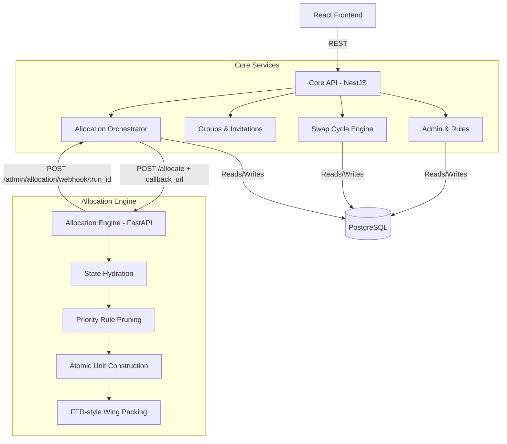
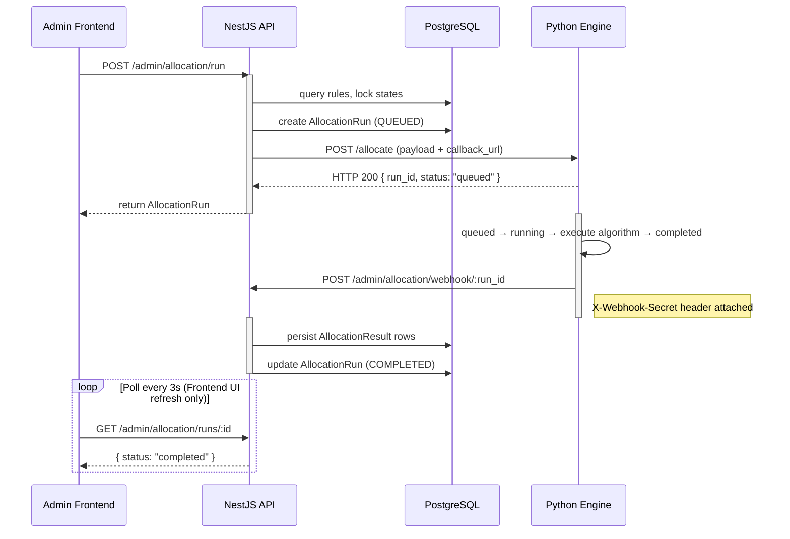
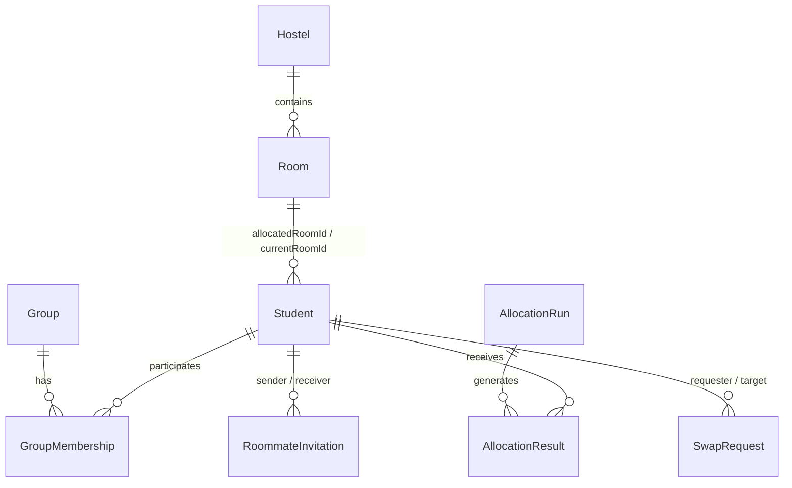

# Hostel Allocation System

A two-stage, heuristic-based automated room allocation engine designed to resolve large-scale student placement across multiple hostels, satisfying prioritized administrative rules, group cohesion preferences, and atomic roommate constraints.

The system is split into a robust administrative REST API (NestJS) and an asynchronous, in-memory allocation orchestrator (FastAPI).

---

## System at a Glance

* **Multi-Stage Heuristic Pipeline:** Replaces traditional manual assignment with a deterministic priority-ordered candidate pruning phase followed by an FFD-style descending-size greedy packing heuristic.
* **Global Optimization (CP-SAT):** A sophisticated 4th allocation mode powered by Google OR-Tools that mathematically maximizes global happiness using lexicographical weights while enforcing strict administrative and roommate constraints.
* **Bounded Preferences:** Students and groups can rank their preferred hostels. These act as a secondary sorting heuristic bounded strictly by their administrative eligibility.
* **Atomic Roommate Units:** Pre-packing phase binds accepted roommates into unsplittable units, enforcing roommate co-location before capacity validation.
* **DFS Cycle Detection:** Directed graph modeling of swap requests allowing automated discovery and execution of multi-party room exchange cycles.
* **Transactional Publication + Snapshot-Based Restore:** State commits utilize pre-mutation JSONB snapshots within PostgreSQL `SERIALIZABLE` transactions, ensuring safe application-level compensating restores of bulk assignments.

---

## 1. Problem Model

Hostel allocation is not a standard CRUD application; it is a constrained resource assignment problem.

**S** = Students applying for rooms (grouped or individual).
**R** = Physical rooms (bins with fixed capacities).
**C** = Administrative rules (e.g., "Year 1 students must go to Hostel A").

The engine must assign every $s \in S$ to an $r \in R$ such that:

1. **Hard Constraints:** Room capacity is not exceeded, gender policies are strictly enforced, and mutually accepted roommate pairs are placed in the same room.
2. **Priority Constraints:** Multi-dimensional administrative rules (hostel, wing, year) dictate where cohorts are allowed or blocked.
3. **Heuristic Optimization:** Large student groups are placed in the highest-proximity available rooms to maximize social cohesion.

---

## 2. Architecture



### Boundary Definitions

* **Core API (NestJS):** Owns persistent domain state (Students, Rooms, Rules, Results). Provides transactional integrity for administrative commits and handles user workflows.
* **Allocation Engine (Python):** Owns ephemeral execution state. Operates over a hydrated in-memory context, so candidate-pruning and packing inner loops do not perform database round trips.

---

## 3. Allocation Engine & Algorithms

### 3.1 Priority-Ordered Candidate Pruning

The first stage reduces the candidate space of all rooms down to a valid subset for each student.

**Algorithm:** Priority-ordered first-match rule resolver.

1. All rules are sorted descending by priority.
2. The engine evaluates rules linearly against the student's properties (year) and the room's properties (hostel, wing).
3. The *first matching rule* dictates whether the room is allowed or blocked.
4. Gender policies act as a hard boolean mask applied before rules.

**Worked Priority-Rule Example:**
Consider `Student(year: 2)`.
`Room(hostel: A, wing: North)`

*Rules Evaluated (Desc Priority):*

* Rule 1 (Priority 200, Year: 1, Hostel: A): *No match*
* Rule 2 (Priority 150, Year: 2, Hostel: A): **Match! (Decision: ALLOW)**
* Rule 3 (Priority 50, Year: 2, Hostel: A, Wing: North): *Not evaluated (Rule 2 already decided)*

**Determinism Warning:**
The candidate-pruning function is deterministic for a fixed ordered rule input. However, end-to-end rule resolution is not guaranteed deterministic for conflicting equal-priority rules because the TypeORM query (`queryRunner.manager.find()`) does not specify ordering and Python's stable sort preserves incoming order among equal-priority rules.

If Rule A (Priority 100, ALLOW) and Rule B (Priority 100, DENY) match, the outcome is strictly dependent on the unspecified row order returned by PostgreSQL.

### 3.2 Hierarchical Placement Strategy

Placement decisions operate at three granularities:

1. **Student × Room** → Eligibility resolution (Candidate Pruning).
2. **Group × Wing** → Placement-region selection.
3. **Atomic Unit × Room** → Capacity packing.

**Normal Group Placement Path:**
group received → determine wings where every member is eligible → evaluate whether whole group can fit → rank candidate wings → construct atomic roommate units → descending-size room packing.

**Fallback Split Path:**
whole-group placement fails (no single wing fits all) → select initial wing → pack atomic units that fit → calculate proximity score for alternative wings → continue placement without splitting atomic units.

### 3.3 FFD-Style Descending-Size Packing Heuristic

After pruning, the engine places students using a greedy bin-packing approach designed to maximize group cohesion.

**ITEM:** Atomic units (arrays of size 1 or 2 students).
**BIN:** Rooms within a physical Wing.
**ITEM SIZE:** 1 or 2.
**BIN CAPACITY:** Available beds (1 to 4).
**BIN ORDER:** Wings are sorted by unit-fit capability, then by rule priority, then by total capacity.
**FIRST-FIT CONDITION:** The algorithm sorts units descending by size (placing pairs before individuals) and places each unit into the first room with sufficient remaining capacity.

This is an FFD-style descending-size greedy packing heuristic. It differs from textbook FFD because it heavily modifies bin ordering by factoring in rule priority and a consolidation score (occupying partially full rooms first), rather than purely sorting bins by remaining capacity.

### 3.4 Bounded Hostel Preferences

To accommodate student choice without violating administrative boundaries, the system supports ranked `hostelPreferences` for individuals and `groupPreferences` for groups.
The core design principle is that **administrative rules remain the absolute source of truth**. Preferences act merely as a secondary lexicographical sorting heuristic. A student can never be placed into a hostel they are administratively blocked from, regardless of their preference rankings.

### 3.5 Global Optimization (CP-SAT)

In addition to the legacy FCFS and heuristic modes, the engine features a `global_optimization` mode using the Google OR-Tools CP-SAT solver.

* **Pre-Pruning:** The boolean search space is drastically reduced by first passing students through the administrative candidate pruning phase. Variables are only instantiated for valid rooms.
* **Constraints:** The solver strictly enforces hard constraints: max 1 room per student, room capacities, and atomic roommate units (forcing assigned boolean variables to be strictly equal across mutual roommates).
* **Lexicographical Objective:** The objective function dynamically scales weights to guarantee that securing a bed ($W_{base}$) dominates administrative rule priorities ($W_{rule}$), which in turn strictly dominates user preference matching ($W_{pref}$). This prevents the solver from trading a bed assignment for preference points.

---

## 4. End-to-End Allocation Lifecycle



### Dual Allocation State Machines

The allocation workflow depends on two related state machines.

1. **Persistent orchestration state:** PostgreSQL / NestJS `AllocationRun` (`QUEUED`, `RUNNING`, `COMPLETED`, `FAILED`).
2. **Ephemeral execution state:** Python `allocation_runs` in-memory dictionary.

**Webhook Push Model:** When Python finishes (success or failure), it POSTs results to `POST /admin/allocation/webhook/:run_id` on NestJS with a shared `X-Webhook-Secret` header. NestJS validates the secret, persists the results, and transitions the run to `COMPLETED` or `FAILED`.

**Startup Reconciliation:** `AdminService.onModuleInit()` queries the database for any `QUEUED` or `RUNNING` runs on every NestJS startup. For each stale run, it calls `GET /allocation/{run_id}` on Python. If Python returns 404 (run is lost from memory), the run is immediately marked `FAILED`. If Python returns a terminal status, results are saved accordingly. This eliminates permanently orphaned runs caused by process restarts.

If Python crashes or restarts, its in-memory state clears. The startup reconciliation hook will detect the 404 on the next NestJS start and mark the run `FAILED`.

---

## 5. Swap Engine and Graph Cycles

Students issue direct or open swap requests, forming a directed graph where edges represent `requesterId -> targetStudentId`.

### Cycle Detection

The engine implements **Depth-First Search (DFS)** using `visited` and recursion stack (`recStack`) sets to trace paths. When a back-edge is found in the `recStack`, a valid cycle is extracted and validated against gender and cross-hostel year constraints.

### Execution Risks

`executeSwapChain` loops over the participants, updating `Student.currentRoomId` sequentially (`await this.studentRepository.save()`) without a database transaction.

* **Atomicity Failure / Partial Persistence:** A mid-loop failure can persist a partial assignment rotation, leaving the database in a state that no longer represents a valid execution of the original swap cycle.
* **Invariant Violation:** Because `currentRoomId` is not unique, a partial rotation can leave one room with zero student references while another room has multiple student references. Whether this violates capacity depends on the target room's configured capacity (e.g. 2 students pointing to a 1-capacity room).
* **Validation TOCTOU:** The chain is validated fully before the loop begins. A concurrent administrative edit between validation and iteration will result in a stale graph execution.

---

## 6. Transactional Publication + Snapshot-Based Restore

When an allocation is published, NestJS utilizes a `SERIALIZABLE` transaction to apply room mutations and write a deep JSONB snapshot of the pre-mutation state into the `AdministrativeAction` audit table.

The publication is atomic inside the `SERIALIZABLE` transaction. The JSONB snapshot supports a later **application-level compensating restore**. It is NOT a rollback of the original committed PostgreSQL transaction.

If a mistake is made:

1. Original transaction COMMITs.
2. Snapshot remains in the audit log.
3. Later administrative restore operation reads the snapshot.
4. New transaction reapplies the captured state.

---

## 7. Complexity Model

Algorithmic upper bounds derived from the implementation (these bounds differ from real-world average cases due to early termination and heuristic pruning).

* $S$ = Students
* $G$ = Groups
* $R$ = Rooms
* $U$ = Allocation rules
* $W$ = Wings
* $A_g$ = Atomic units in group $g$
* $V$ = Swap graph vertices
* $E$ = Swap graph edges

| Stage | Algorithmic Bound | Notes |
| :--- | :--- | :--- |
| **Candidate Pruning** | $O(S \cdot R \cdot U)$ | Iterates all rules for all rooms per student. |
| **Atomic Unit Construction** | $O(S)$ | Linear pass grouping verified mutual accepts. |
| **Wing Ranking** | $O(G \cdot W \log W)$ | Sorted dynamically once per group. |
| **Descending Unit Sort** | $\sum O(A_g \log A_g)$ | Sort units within each group by size. |
| **Room Packing** | $O(S \cdot R)$ | In worst case, a unit scans all rooms in a wing. |
| **DFS Cycle Detection** | $O(V + E)$ | Standard recursive DFS. |

---

## 8. Persistence Model



### Schema-Enforced Invariants

* Foreign key constraints heavily govern relational integrity (e.g. deleting a Hostel with Rooms fails).
* `Student.rollNumber` is uniquely constrained.

### Application-Enforced Invariants (Vulnerable to DB races)

* **Roommate Uniqueness:** The application checks for existing `ACCEPTED` invitations before allowing a new one, but there is no schema-level check.
* **Room Capacity:** `Student.currentRoomId` does NOT have a unique constraint, allowing capacity violations during a partial swap failure.
* **Rule Priorities:** Equal priorities are not constrained or ordered by the schema, leading to application-level non-determinism.

---

## 9. API Surface

| Domain | Method | Route | Auth / Role | Purpose |
| :--- | :--- | :--- | :--- | :--- |
| **Auth** | POST | `/auth/login` | Public | Authenticate user, issue JWT. |
| **Students** | GET | `/students/me` | `JwtAuthGuard` | Fetch current student context. |
| **Groups** | POST | `/groups` | `JwtAuthGuard` | Create a proximity group. |
| **Invitations** | POST | `/roommate-invitations` | `JwtAuthGuard` | Send a roommate request. |
| **Admin** | POST | `/admin/allocation/run` | `JwtAuthGuard` | Dispatch an Allocation Run. |
| **Admin** | POST | `/admin/allocation/runs/:id/publish` | `JwtAuthGuard` | Commit results to live state. |
| **Admin** | POST | `/admin/allocation/webhook/:run_id` | `X-Webhook-Secret` (internal) | Receive allocation result push from Python engine. |
| **Swaps** | GET | `/swaps/detect-cycles` | `JwtAuthGuard` | Returns valid exchange cycles. |
| **Swaps** | POST | `/swaps/execute-chain` | `JwtAuthGuard` | Iteratively execute a swap cycle. |

**Important Execution Flow: Publish Allocation**
HTTP POST `/admin/allocation/:id/publish` → `AdminController` → `AdminService.publishAndCommitRun()` → `this.dataSource.transaction(SERIALIZABLE)` → Updates `AllocationResult.isLocked`, `Room.status`, `Student.currentRoomId` → Writes `AdministrativeAction` JSONB Snapshot → HTTP 200 Response.

---

## 10. Authentication and Authorization

The API uses Passport-based JWT Authentication.
**Request Path:** Request → `JwtAuthGuard` → JWT Validation (`JwtStrategy`) → Authenticated Principal (`req.user`) → Controller.

Controller-level inspection shows authentication guards but no explicit role guard on these routes. Service-level inspection also reveals no explicit administrative role validation. This is an authorization gap and a broken access-control risk; frontend route restrictions alone would not constitute a server-side authorization boundary. This represents a significant risk for high-impact actions like triggering allocations and executing swap chains.

---

## 11. Engineering Decisions and Trade-Offs

| Decision | System Constraint | Chosen Approach | Alternative Considered | Trade-Off |
| :--- | :--- | :--- | :--- | :--- |
| **Engine Separation** | Heavy computation blocks the Node.js event loop. | Separate Python FastAPI engine. | Run logic natively in NestJS. | Avoids event loop starvation but introduces a distributed state coordination problem. *(Architectural effect of the current design).* |
| **Context Hydration** | Candidate evaluation performs nested student-room-rule iteration; database access inside these inner loops would introduce repeated database/network round trips. | NestJS materializes the allocation context and sends it to the engine as a JSON payload. | Python queries PostgreSQL directly during evaluation. | Inner algorithmic loops operate on local memory, but each run pays serialization, transfer, and per-run memory costs and evaluates a snapshot that can become stale relative to later database mutations. |
| **Rule Resolution** | Extremely fast decision bounds needed. | Priority-ordered first-match resolver. | Constraint Satisfaction Problem (CSP). | Highly deterministic (with strictly ordered rules) but sacrifices mathematical optimality. |
| **Swap Execution** | Multi-party cycles require rotation. | Non-transactional sequential loop. | `dataSource.transaction`. | Leaves the system vulnerable to partial execution failures and TOCTOU bugs. |
| **Snapshot Restore** | Admins need safety for bulk commits. | JSONB pre-mutation snapshot stored for compensating restores. | Event Sourcing (CQRS). | Event-sourced reconstruction would require a broader event model and replay semantics, while the current pre-mutation snapshot is simpler for restoring the specific bulk administrative state represented by the workflow. Restoring state requires applying mutations proportional to the captured entities. |

---

## 12. Testing and Verification

**What the Repository Tests:**
The repository currently lacks a formalized, comprehensive test suite in the provided context structure. Minimal default unit tests (e.g. `app.controller.spec.ts`) exist.

**What the Repository Does Not Yet Prove:**
There is **no automated coverage** verifying:

* Roommate atomicity guarantees under stress.
* Locked assignment preservation.
* Deterministic handling of equal-priority rule conflicts.
* Concurrent swap mutation safety.
* Orchestrator restart recovery.

---

## 13. Repository Structure

```text
├── core-services/             # NestJS API (Port 3000)
│   ├── src/
│   │   ├── auth/              # JWT Authentication
│   │   ├── admin/             # Allocation orchestration & rule endpoints
│   │   ├── swaps/             # DFS cycle detection & non-transactional execution
│   │   ├── entities/          # TypeORM Models (PostgreSQL schema)
│   │   └── main.ts            # NestJS Bootstrap
│   ├── package.json           # Node dependencies
├── allocation-engine/         # Python FastAPI Engine (Port 8000)
│   ├── app/
│   │   ├── main.py            # API endpoints & in-memory run tracking
│   │   └── allocation.py      # Core Algorithm (Pruning, Atomic Units, FFD)
│   ├── requirements.txt       # Python dependencies
├── frontend/                  # React SPA (Vite)
│   ├── app/
│   │   ├── routes/            # Route components (admin, student)
```

---

## 14. Prerequisites, Environment, and Local Development

**Prerequisites:**

* Node.js (v18+)
* Python (3.10+)
* PostgreSQL
* Docker & Docker Compose (optional)

**Environment Variables:**
Core API (NestJS) `.env` structure:

* `DB_HOST`, `DB_PORT`, `DB_USERNAME`, `DB_PASSWORD`, `DB_DATABASE`
* `JWT_SECRET` (Required secret, do not expose in source control)
* `ALLOCATION_ENGINE_URL` — Base URL of the Python engine (default: `http://localhost:8000`; Docker: `http://allocation-engine:8000`)
* `WEBHOOK_SECRET` — Shared secret used to authenticate webhook calls from Python (must match the engine's env)
* `CORE_SERVICES_BASE_URL` — Public URL of this NestJS service, used to build the `callback_url` sent to Python (bare-metal: `http://localhost:3000`; Docker: `http://core-services:3000`)

**Startup Commands (Verified):**

* **Database:** `docker-compose up -d`
* **NestJS:** `cd core-services && npm install && npm run start:dev`
* **Python:** `cd allocation-engine && pip install -r requirements.txt && uvicorn app.main:app --reload --port 8000`
* **Frontend:** `cd frontend && npm install && npm run dev`

---

## 15. Deployment Topology

The system deploys as three independent compute processes communicating over HTTP, supported by a single persistent data store.

* **Frontend:** Statically built SPA served to clients.
* **Core API (NestJS):** Owns all persistent state, running on Node.js.
* **Database (PostgreSQL):** The single source of truth.
* **Allocation Engine (Python):** Purely ephemeral compute process. Holds no persistent connections to the database.

The NestJS API is largely backed by PostgreSQL for domain state, but allocation orchestration still includes process-local polling continuations. Scaling the API horizontally therefore requires explicit run ownership or reconciliation coordination. Python engine scaling is similarly constrained by its process-local allocation run state.

---

## 16. Technical Roadmap

### P0 — Data Integrity

* Transactional Swap Execution: Wrap `executeSwapChain` in `dataSource.transaction`.
* Database-Level Roommate Invariant: Move accepted roommate relationships to a schema that enforces unique student participation in at most one active pair, rather than relying only on service-level invitation checks.

### P1 — Determinism

* Explicit Secondary Rule Ordering: Add an `ORDER BY id ASC` clause to the TypeORM query fetching rules to resolve equal-priority conflicts predictably.

### P2 — Orchestration Durability ✅ Implemented

* ~~Startup Reconciliation~~ **Done:** `AdminService.onModuleInit()` scans for `QUEUED`/`RUNNING` runs on startup and reconciles against the Python engine's in-memory state.
* ~~In-memory polling~~ **Done:** Replaced the `setTimeout` polling loop with a webhook push model. Python POSTs results to `POST /admin/allocation/webhook/:run_id` (secured with `X-Webhook-Secret`) on completion or failure.

### P3 — Allocation Quality

* Measurement: Measure and log group split counts and unallocated student counts systematically.
